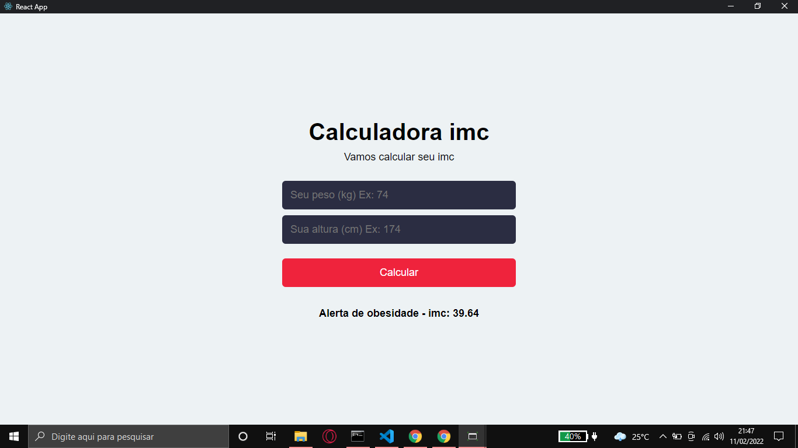

# Calculadora imc - React

 

Aplicação foi feita para praticar conceitos de React aprendidos na aula 1 do WorkShop ReactJS que estou fazendo no canal do youtube https://www.youtube.com/c/Sujeitoprogramador.

## Conceitos abordados

- Instalação do ReactJS (create-react-app);
- Limpar a aplicação padrão;
- Criar componentes;
- Uso do hook "useState" e como manipular;
- Ligar arquivo CSS com o React.

